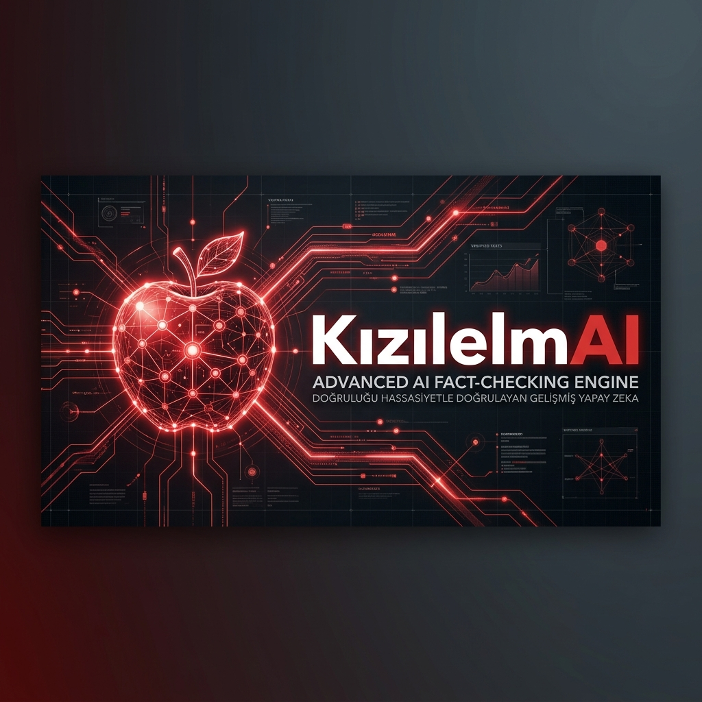
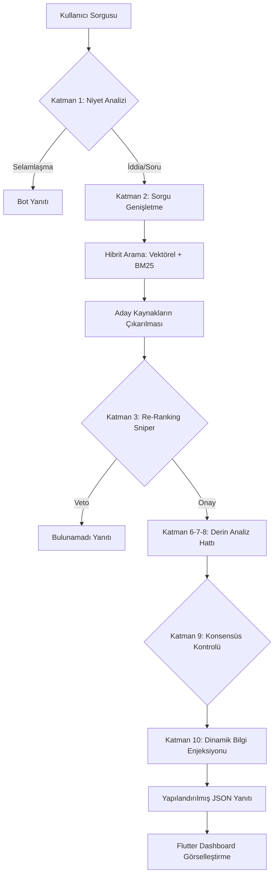
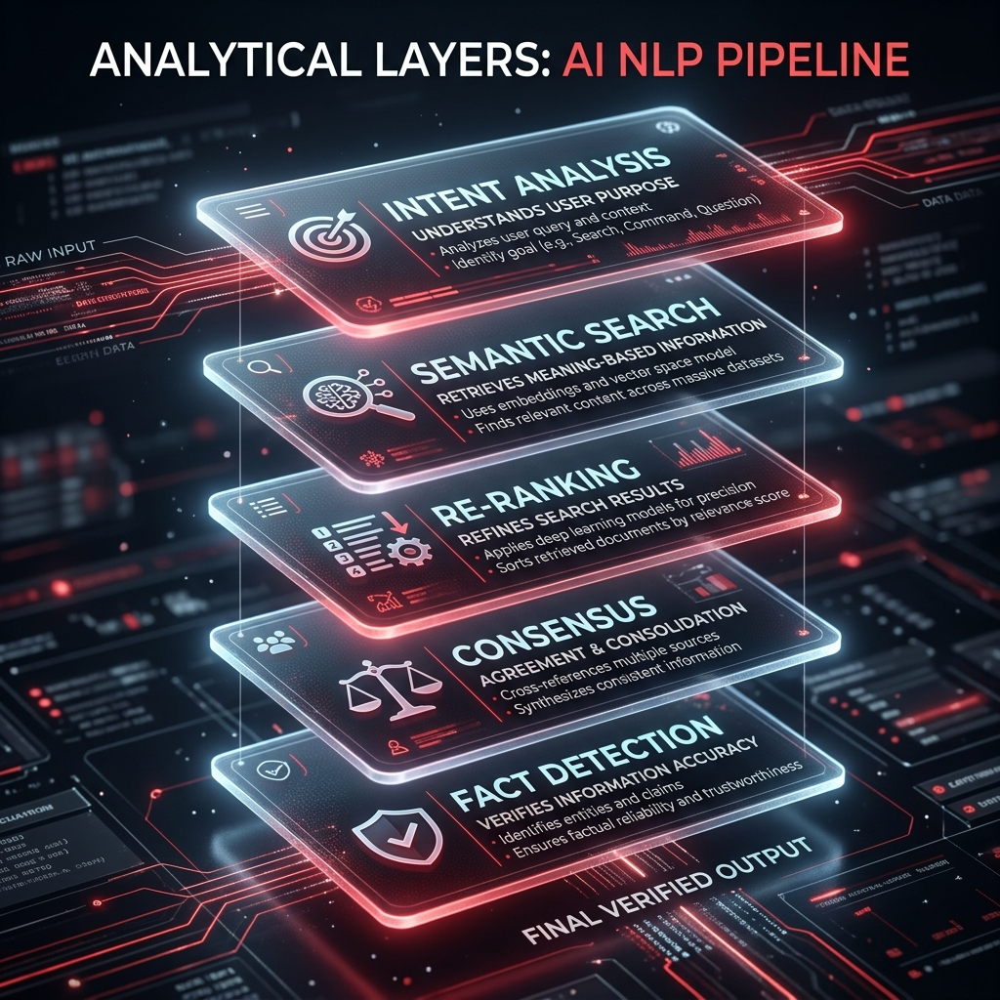

<p align="center">
  
</p>

# 🛡️ KızılelmAI: Yerel Analiz ve Doğrulama Motoru (v3.0 Elite)

<p align="center">
  
  
  
  <br>
  
</p>



> "Bilgi kirliliğine karşı yerli ve milli bir kalkan."

KızılelmAI, modern Doğal Dil İşleme (NLP) tekniklerini kullanarak haberlerin ve iddiaların doğruluğunu çok katmanlı bir süzgeçten geçiren, yüksek performanslı bir analitik motor ve görselleştirme dashboard'udur.

## 🚀 Proje Vizyonu (Vision)

**KızılelmAI**, modern dezenformasyon ve makamsal manipülasyon tehditlerine karşı geliştirilmiş, tamamen yerel (offline) çalışan bir hakikat bekçisidir. Proje, sadece bir yapay zeka sohbet botu değil; her iddiayı 10 farklı analitik katmanda sorgulayan bir **doğrulama mühendisliği** ürünüdür.

---

## 🏛️ Mimari Bakış (Architecture)

KızılelmAI, "Beyin" (Python/FastAPI) ve "Yüz" (Flutter) olmak üzere iki ana bileşenden oluşur. Aşağıdaki şema, bir kullanıcının gönderdiği iddianın sistem içerisinde nasıl bir yolculuk yaptığını göstermektedir.



---

## 🚀 Kullanılan Teknolojiler ve Tercih Sebepleri

Bu projede kullanılan her kütüphane ve framework, projenin "hızlı, yerel ve bağımsız" olma vizyonuna hizmet eder.

### 1. Arka Plan (Backend) & NLP
*   **FastAPI**: Python'un en hızlı web framework'üdür. Asenkron (async) yapısı sayesinde aynı anda binlerce talebi düşük gecikme ile işleyebilir.
*   **Sentence Transformers (intfloat/multilingual-e5-small)**: Metinleri sayısal vektörlere dönüştürür. "Anlamsal arama" (Semantic Search) yapmamızı sağlar.
*   **Cross-Encoders (BAAI/bge-reranker-v2-m3)**: "Keskin Nişancı" modelimizdir. Arama sonuçlarının iddianızla ne kadar örtüştüğünü milimetrik hassasiyetle ölçer.
*   **Rank-BM25**: Anahtar kelime bazlı aramadır. Klasik "Google tarzı" aramayı vektörel arama ile birleştirerek (Hybrid Search) doğruluk payını artırır.
*   **XLM-RoBERTa (XNLI)**: Doğal Dil Çıkarımı (NLI) modelimiz. İki cümle arasındaki mantıksal ilişkiyi (Destekliyor / Çelişiyor / Nötr) analiz eder.

### 2. Ön Plan (Frontend)
*   **Flutter**: Tek bir kod tabanıyla hem web hem mobil uygulama geliştirmemizi sağlar.
*   **Dart**: Tip güvenliği ve hızı sayesinde veri yoğunluklu dashboard'lar için idealdir.

---

## 🔍 Derin Analiz Hattı: 10 Katmanlı Süzgeç



KızılelmAI'yi rakiplerinden ayıran en önemli özellik, bir iddiayı doğrularken geçtiği analitik aşamalardır:

| Katman | Adı | İşlevi |
| :--- | :--- | :--- |
| **L1** | **Niyet Analizi** | Kullanıcı selam mı veriyor yoksa ciddi bir iddiada mı bulunuyor? (Greeting vs Claim) |
| **L2** | **NLP Sorgu Genişletme** | "Maraş" yazıldığında sistem bunu otomatik olarak "Kahramanmaraş" olarak genişletir. |
| **L3** | **Re-Ranking (The Sniper)** | Binlerce kayıt arasından en alakalı olanı seçen ve alakasızları veto eden "Keskin Nişancı" katmanı. |
| **L4** | **Vektörel Benzerlik** | Kelimeler farklı olsa bile anlamın (context) aynı olup olmadığını ölçer. |
| **L5** | **Kelime Çapası** | Cümledeki kritik anahtar kelimelerin kaynakta geçip geçmediğini manuel kontrol eder. |
| **L6** | **Akıllı Fark Analizi** | Tarih asımı, sayısal hatalar ve unvan değişikliklerini (Örn: Vali vs Belediye Başkanı) yakalar. |
| **L7** | **Konsept Birleştirici** | Önceki sorulardaki bağlamı hatırlar. "Peki ya Ankara?" dendiğinde konunun "deprem" olduğunu bilir. |
| **L8** | **Otorite Ağırlığı** | Kaynağın güvenilirliğini (Resmi Gazete vs Blog) skora dahil eder. |
| **L9** | **Çok Kaynaklı Konsensüs** | Birden fazla kaynağın aynı fikirde olup olmadığını, çelişki olup olmadığını denetler. |
| **L10** | **Dinamik Enjeksiyon** | Sisteme yeniden başlatmadan, çalışma anında yeni bilgiler ("sıcak haberler") aşılanabilir. |

---

## 💻 Kod Derin Dalışı (Code Deep Dive)

### 1. `engine.py` (Zeka Merkezi)
Bu dosya sistemin kalbidir. `KizilelmaEngine` sınıfı tüm modelleri belleğe yükler ve `ask()` fonksiyonu ile süreci koordine eder.

*   **`setup_paths`**: Veri yollarını ve yerel model dizinlerini dinamik olarak ayarlar.
*   **`load_data`**: CSV ve JSON formatındaki bilgi tabanını yükler.
*   **`karar_motoru`**: NLI modeli ve fark analizinden gelen verileri birleştirerek "DOĞRU", "YANLIŞ" veya "GÜNCEL DEĞİL" kararını verir.

### 2. `app.py` (API Katmanı)
FastAPI kullanarak dış dünyaya kapı açar.
*   **`/api/chat`**: Flutter uygulamasından gelen soruları alır ve `run_in_threadpool` kullanarak CPU yoğunluklu analizi ana sistemi dondurmadan çalıştırır.
*   **`/api/inject`**: Dışarıdan anlık veri girişi sağlar.

---

## 🛠️ Kurulum ve Çalıştırma

### Gereksinimler
- Python 3.9+
- CUDA destekli GPU (Tavsiye edilir ama zorunlu değildir)
- 8GB+ RAM

### backend Kurulumu
1. Bağımlılıkları yükleyin:
   ```bash
   pip install -r requirements.txt
   ```
2. API Sunucusunu başlatın:
   ```bash
   python src/backend/app.py
   ```

### Frontend (Flutter) Başlatma
```bash
cd frontend
flutter run -d web-server --web-port 8080
```

---

## 🎯 Projenin Amacı ve Geleceği
Bu proje, akademik bir çalışma olarak geliştirilmiştir. Amacı, bilgi kirliliğinin (disinformation) yoğun olduğu günümüz sosyal medya çağında, kullanıcılara veriye dayalı, mantıksal ve şeffaf bir doğrulama aracı sunmaktır. 

**KızılelmAI**, bir yapay zekadan daha fazlasıdır; o bir **hakikat bekçisidir.**

---

