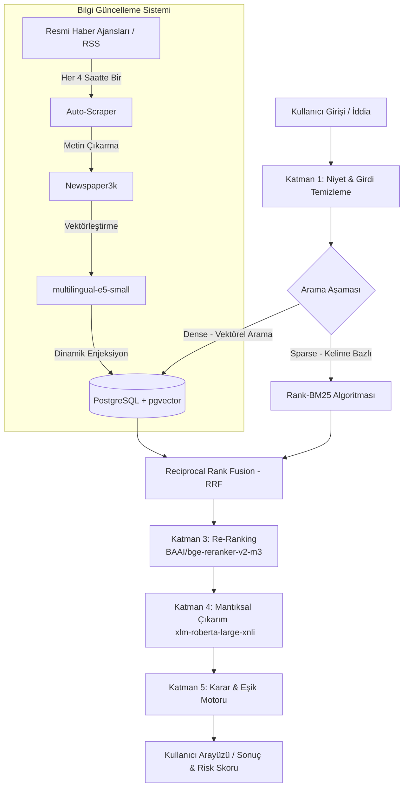

<div align="center">
  
  <h1>KızılelmAI - Gelişmiş Haber Doğrulama Motoru</h1>
  <p>Yerel ve milli imkanlarla geliştirilmiş, yapay zeka destekli %100 otonom haber ve iddia doğrulama (Fact-Checking) sistemi.</p>
</div>

---

## 📌 Proje Hakkında ve Amaç
KızılelmAI, internette ve sosyal medyada yayılan haberlerin, iddiaların veya metinlerin **gerçek mi yoksa yalan/dezenformasyon mu** olduğunu saniyeler içinde analiz eden yapay zeka tabanlı bir doğrulama (Fact-Checking) motorudur. 

Sistem sadece basit bir kelime eşleşmesi veya arama motoru sorgusu yapmaz; arka planda çalışan devasa bir **Vektörel Veritabanı (Knowledge Base)** yardımıyla iddiaları anlamsal olarak tarar, resmi ve doğrulanmış haber kaynaklarıyla karşılaştırır ve mantıksal çıkarım yaparak bir doğruluk yüzdesi ile risk skoru hesaplar.

### Proje Amaçları:
*   **Dezenformasyonla Mücadele:** Sosyal medyadaki bilgi kirliliğini ve yalan haberlerin yayılma hızını en aza indirmek.
*   **Otonom Doğrulama:** Manuel teyit mekanizmalarını yapay zeka ile hızlandırarak otomatik hale getirmek.
*   **Hibrit Arama (RAG):** Hem anlamsal (vektörel) hem de kelime bazlı (BM25) aramayı birleştirerek en doğru resmi haber kaynaklarına ulaşmak.

---

## 🏗️ Sistem Mimarisi (Architecture)

KızılelmAI, modern bir **Retrieval-Augmented Generation (RAG)** ve **Doğal Dil Çıkarımı (NLI)** mimarisi üzerine kurulmuştur. Sistem mimarisinin veri akış diyagramı aşağıda gösterilmiştir:



### 🧠 10 Katmanlı Yapay Zeka Motoru Çalışma Prensibi

1.  **Girdi Normalizasyonu (Katman 1):** Kullanıcının yazdığı metin temizlenir, imla hataları giderilir ve anlamsal niyet analizi yapılarak gereksiz sorgular elenir.
2.  **Hibrit Arama (Dense + Sparse Retrieval - Katman 2):** İddia anında vektörleştirilir. PostgreSQL vektör veritabanında **Kosinüs Mesafesi** ile anlamsal yakınlık aranırken, eşzamanlı olarak `BM25` ile kelime araması yapılır. Sonuçlar RRF ile birleştirilir.
3.  **Yeniden Sıralama (Re-Ranking - Katman 3):** `BAAI/bge-reranker-v2-m3` Cross-Encoder modeliyle, arama sonuçlarından gelen yüzlerce kaynaktan sadece sorguyla en yüksek düzeyde eşleşen ilk 3 haber seçilir.
4.  **Mantıksal Çıkarım (NLI - Katman 4):** `joeddav/xlm-roberta-large-xnli` modeli kullanılarak seçilen en güçlü kaynaklar ile kullanıcının iddiası karşılaştırılır: *Örtüşüyor mu (Entailment), Çelişiyor mu (Contradiction) yoksa Nötr mü?*
5.  **Karar Motoru (Katman 5):** NLI olasılık skorları matematiksel eşik değerlerinden geçirilerek nihai "Doğru", "Yalan" veya "Şüpheli" kararı verilir.
6.  **Ön Sezgi Sınıflandırıcısı (Katman 6):** Dil yapısına bakarak metnin clickbait veya dezenformasyon jargonu içerip içermediğini analiz eder.
7.  **Bağlam Hafızası (Katman 7):** Peş peşe gelen sohbet geçmişini (örneğin "Peki ya bu?") hafızasında tutarak arama sorgularını genişletir.
8.  **Otorite Ağırlıklandırması (Katman 8):** Resmi ve güvenilir kaynaklardan gelen haberlere daha yüksek güvenilirlik puanı atar.
9.  **Konsensüs Analizi (Katman 9):** Elde edilen çoklu kaynakların birbiriyle çelişip çelişmediğini kontrol eder.
10. **Dinamik Enjeksiyon (Katman 10):** Admin panelinden girilen yeni haberler veya otomatik scraper'ın bulduğu içerikler sistem durdurulmadan vektör veritabanına eklenir.

---

## 📁 Repository Dosya Yapısı

Repository yapısı, proje standartlarına uygun olarak aşağıdaki gibi organize edilmiştir:

```text
├── README.md                 # Projeyi ve kurulumu anlatan ana dosya (Bu dosya)
├── report.pdf                # Projenin teknik tasarım ve analiz raporu
├── docker-compose.yml        # Tüm servisleri tek tuşla ayağa kaldıran konfigürasyon
├── Dockerfile                # Backend uygulamasının Docker imaj dosyası
├── requirements.txt          # Python bağımlılık listesi
├── .dockerignore             # Docker imajına dahil edilmeyecek dosyalar listesi
├── docs/                     # Projeye ait ek dokümantasyonlar, API dökümanları
├── simulations/              # Yapay zeka modelleri ve veri seti test simülasyonları
├── results/                  # Test sonuçları, grafikler ve performans raporları
├── presentation/             # Proje sunum dosyaları (slaytlar, videolar)
├── src/                      # Backend ve Yapay Zeka motorunun ana kaynak kodları
│   ├── backend/              # FastAPI API Sunucusu ve yönlendiriciler
│   ├── ai_core/              # Yapay zeka motoru, RAG, NLI ve Scraper katmanları
│   └── shared/               # Ortak kullanılan veritabanı bağlantı ve yardımcı modülleri
└── frontend/                 # React & Vite ile yazılmış Nginx sunuculu kullanıcı arayüzü
```

---

## 🚀 Adım Adım Kurulum ve Çalıştırma Rehberi

KızılelmAI, konteyner teknolojisi ile paketlenmiştir. Bu sayede yerel bilgisayarınızda Python, Node.js veya PostgreSQL kurulu olmasına gerek kalmadan **sadece Docker** kullanarak tüm sistemi ayağa kaldırabilirsiniz.

### Gereksinimler:
*   [Docker Desktop](https://www.docker.com/products/docker-desktop/) (Windows/macOS/Linux için kurulu ve çalışır durumda olmalıdır).

---

### Adım 1: Projeyi Klonlayın
Öncelikle terminal veya komut satırını açarak projeyi yerel bilgisayarınıza indirin ve proje dizinine girin:

```bash
git clone https://github.com/ETU-Digital-Design-Lab/bsc-2026-group-5-kizilelmai-news-verifier.git
cd bsc-2026-group-5-kizilelmai-news-verifier
```

### Adım 2: Docker Konteynırlarını Ayağa Kaldırın
Aşağıdaki komut, arka planda PostgreSQL (pgvector ile), Redis, Python FastAPI (Backend) ve React/Nginx (Frontend) konteynırlarını otomatik olarak derler ve çalıştırır:

```bash
docker compose up --build -d
```

*   **Derleme Süresi:** İlk çalıştırmada yapay zeka modelleri (HuggingFace cache) ve python kütüphaneleri indirileceği için internet hızınıza bağlı olarak bu işlem 5-10 dakika sürebilir.
*   **İzleme:** Docker Desktop arayüzünden veya `docker ps` komutuyla konteynırların durumunu takip edebilirsiniz.

### Adım 3: Vektörel Veritabanını Doldurun (Haber Kaynakları Enjeksiyonu)
Konteynırlar ayağa kalktığında veritabanınız boş olacaktır. Sistemin anlamsal arama yapabilmesi için internetten indirilen **30.000 adetlik dengeli haber setini** vektörleştirerek PostgreSQL'e yükleyen hazırlık betiğini (script) çalıştırın:

```bash
docker compose exec backend python src/ai_core/ingest/prep_30k_data.py
```

*   Bu betik internetten 15.000 gerçek, 15.000 yalan haberi indirir.
*   Metinleri temizler ve `multilingual-e5-small` modeliyle 384 boyutlu vektörlere dönüştürerek veritabanına yazar.
*   Bu işlem bilgisayarınızın donanım gücüne göre birkaç dakika sürebilir.

### Adım 4: Arayüze Bağlanın
Kurulum başarıyla tamamlandıktan sonra tarayıcınızı açıp aşağıdaki adreslere gidebilirsiniz:

*   **Kullanıcı Arayüzü (Frontend):** [http://localhost](http://localhost)
*   **API Dökümantasyonu (Swagger UI):** [http://localhost:5000/docs](http://localhost:5000/docs)

---

## 🛠️ Kullanılan Teknolojiler ve Tercih Nedenleri

| Teknoloji / Kütüphane | Kullanım Amacı | Tercih Nedeni |
| :--- | :--- | :--- |
| **Python & FastAPI** | Backend / API Katmanı | Asenkron (`async`) mimarisi sayesinde yüksek trafik altında çok hızlı ve performanslıdır. |
| **React (Vite)** | Frontend Arayüzü | Kullanıcı deneyimini artıran, sayfa yenilemesiz hızlı arayüz bileşenleri için. |
| **PostgreSQL 16 & pgvector** | Vektör Veritabanı | Yapay zekanın "hafızası" görevini görür. Haberleri anlamsal yakınlıklarına göre milisaniyeler içinde bulur. |
| **Redis** | Önbellekleme (Caching) | Mükerrer sorular sorulduğunda AI modellerine gitmeden hafızadaki hazır cevapları anında döner. |
| **Sentence-Transformers** | Embedding (Vektörleştirme) | `multilingual-e5-small` modeli çok dilli destek sunar ve çıkarım hızı çok yüksektir. |
| **BAAI bge-reranker-v2-m3** | Yeniden Sıralama (Re-ranker) | Kaba aramadan dönen verileri süzerek sadece en alakalı ilk 3 kaynağı hassas şekilde seçer. |
| **xlm-roberta-large-xnli** | Mantıksal Çıkarım (NLI) | İddia ile haber arasındaki çelişki/örtüşme ilişkisini yüksek doğrulukla sınıflandırır. |
| **Newspaper3k & BS4** | Haber Kazıma (Web Scraper) | Otomatik olarak haber sitelerindeki reklam ve kodları ayıklayıp saf haber metinlerini toplar. |
| **Docker & Nginx** | Altyapı ve Sunum | "Benim bilgisayarımda çalışıyordu" sorununu çözer; her ortamda tek komutla kurulum sağlar. |

---

## 🐛 Olası Sorunlar ve Çözümleri

### 1. "Bulut işlemi başarısız oldu" (Cloud operation failed) Hatası
*   **Neden:** Proje dizini OneDrive veya iCloud gibi bulut yedekleme klasörlerinde olduğunda ve yerel `node_modules` dosyaları buluta taşındığında Docker bunlara erişemez.
*   **Çözüm:** Proje kök dizininde ve `frontend/` dizininde oluşturduğumuz `.dockerignore` dosyaları bu sorunu kökten çözer. `.dockerignore` dosyalarının silinmediğinden emin olun.

### 2. GPU / CUDA Kullanımı
*   Sistem varsayılan olarak CPU üzerinde çalışacak şekilde optimize edilmiştir. Eğer NVIDIA ekran kartınız varsa ve CUDA kullanmak istiyorsanız `docker-compose.yml` içerisindeki `deploy.resources.reservations.devices` kısmını aktif hale getirebilirsiniz.

### 3. Modellerin İndirilememesi (Bağlantı Hatası)
*   Sistem ilk ayağa kalkarken HuggingFace sunucularından yaklaşık 2-3 GB model dosyası indirir. İnternet bağlantınızın stabil olduğundan emin olun.

---

## 👥 Ekibimiz
Bu proje **ETU Digital Design Lab** bünyesinde **Grup 5** tarafından geliştirilmiştir.
*   **Proje Adı:** KızılelmAI News Verifier
*   **Geliştiriciler:** Grup 5 Üyeleri
