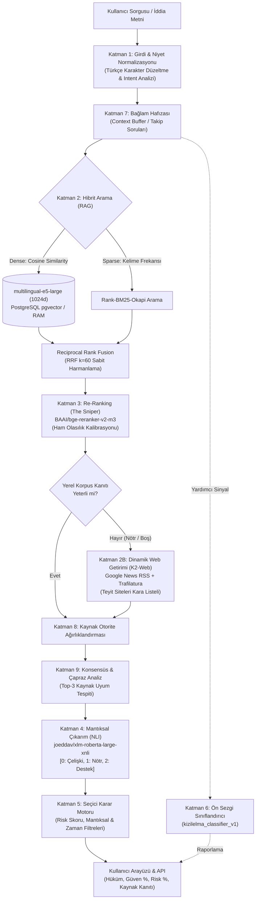

<div align="center">
  
  <h1>KızılelmAI - Gelişmiş Haber ve İddia Doğrulama Motoru</h1>
  <p><strong>Yapay Zeka Destekli, Çok Katmanlı ve Zamana Duyarlı Hibrit Fact-Checking (Doğrulama) Sistemi</strong></p>
  <p>
    <a href="https://github.com/ETU-Digital-Design-Lab/bsc-2026-group-5-kizilelmai-news-verifier"></a>
    
    
    
    
    
    
    
  </p>
</div>

---

## 📌 Proje Hakkında ve Amaç

**KızılelmAI**, internette ve sosyal medyada yayılan haber ve iddiaların **gerçek mi, yanıltıcı mı yoksa asılsız mı** olduğunu saniyeler içinde kanıtlarıyla analiz eden yapay zeka tabanlı bir doğrulama motorudur.

Sistem, yüzeysel anahtar kelime eşleşmelerinin ötesine geçerek; **vektörel ve anlamsal hibrit arama (Dense + Sparse RAG)**, **zamana duyarlı açık web getirimi (Temporal Web Retrieval)**, **derin yeniden sıralama (Cross-Encoder Re-Ranking)**, **kaynak otorite puanlaması** ve **doğal dil çıkarımı (NLI)** katmanlarını bir araya getiren 10 katmanlı bir akıl yürütme mimarisi kullanır.

### Temel Prensipler ve Değer Önerisi:
* **Seçici Tahmin ve Güvenilirlik (Selective Prediction):** Sistem her iddiaya körü körüne tahmin yürütmez. Bilinmeyen veya güvenilir birincil kanıtı bulunmayan iddialarda rastgele tahmin (halüsinasyon) üretmek yerine dürüstçe **çekimser kalır (Abstain / RET)**.
* **Zamansal Uçurumu Aşma (Temporal Gap Bridge):** Statik korpusun (30.487 kayıt, 2021 ve öncesi) kapsayamadığı güncel iddialarda (2022–2026), birincil haber kaynaklarını Google News RSS üzerinden anlık tarayan etik ve dinamik web getirim katmanı devrededir.
* **Sıfır Veri Sızıntısı (Zero Data Leakage):** Teyit siteleri (`teyit.org`, `malumatfurus.org`, `dogrulukpayi.com`, `evrimagaci.org`) sisteme kesin olarak yasaklanmıştır. Model, insan kararlarını kopyalamaz; ham haber metinlerini BGE-Reranker ve XLM-RoBERTa NLI ile kendi zekasıyla doğrular.
* **Dondurulmuş Yerel Korpus Güvencesi:** Akademik tekrarlanabilirlik için yerel korpus (30.487 satır) salt-okunur olarak kilitlenmiştir.

---

## 🏗️ Çok Katmanlı Sistem Mimarisi

KızılelmAI'nin akıl yürütme hattı (reasoning pipeline) aşağıdaki veri akış şemasına sahiptir:



### Katmanların Görev Dağılımı ve Modüler Mimari:

* **Çekirdek Motor (`engine.py`):** Modüler Mixin yapısı ile hafifletilmiştir:
  - [`text_heuristics.py`](file:///src/ai_core/engine/text_heuristics.py): `TextAnalysisMixin` (Normalizasyon, kelime çapası, tarih/sayı fark analizi).
  - [`knowledge_store.py`](file:///src/ai_core/engine/knowledge_store.py): `KnowledgeStoreMixin` (PostgreSQL ve yerel CSV senkronizasyonu).
  - [`response_generator.py`](file:///src/ai_core/engine/response_generator.py): `ResponseGeneratorMixin` (Yanıt formatlama ve kanal tespiti).
* **Katman 2B (Dinamik Web Getirimi - `k2_web_retrieval.py`):** Sosyal medya gürültüsünden ve teyit şablonlarından arındırılmış sorgularla birincil haber kaynaklarından gerçek zamanlı kanıt toplar.
* **Katman 3 (Yeniden Sıralama):** `BAAI/bge-reranker-v2-m3` Cross-Encoder modeliyle aday kanıtları hassas olarak sıralar.
* **Katman 4 (Doğal Dil Çıkarımı):** `joeddav/xlm-roberta-large-xnli` modeli üzerinden iddia ve kanıt metni arasındaki mantıksal ilişkiyi (Destek/Çelişki/Nötr) doğrular.
* **Katman 5 (Seçici Karar & Eşik Motoru):** Yetersiz kanıtta çekimser kalarak yanlış tahmin üretmez; güçlü kanıt varlığında **ONAY (Doğru)** veya **RED (Yalan)** kararı verir.

---

## 🔬 Değerlendirme Sonuçları ve Benchmark Karşılaştırması

Sistem, bağımsız **FACTurk-500** benchmark veri seti üzerinde test edilmiş olup tüm koşumlar tekrarlanabilir şekilde kayıt altına alınmıştır:

### FACTurk-500 Koşumları Evrim Tablosu

| Koşum | Açıklama | Cevaplanan İddia (Kapsama) | Çekimser (RET) | Doğru / Cevaplanan | Cevaplanan Doğruluk | Macro-F1 | Bootstrap %95 GA | Durum |
|:---:|---|:---:|:---:|:---:|:---:|:---:|:---:|:---:|
| **v5** | Erken Temel Sistem (Baseline) | 266 / 500 (%53.2) | 234 (%46.8) | 147 / 266 | %55.26 | 0.5382 | [0.492, 0.612] | Arşiv |
| **v6** | K-4 Doğrulama Koşumu | 273 / 500 (%54.6) | 227 (%45.4) | 148 / 273 | %54.21 | 0.5275 | [0.483, 0.601] | Arşiv |
| **v7** | Büyük Model Geçiş Koşumu | 269 / 500 (%53.8) | 231 (%46.2) | 144 / 269 | %53.53 | 0.5074 | [0.475, 0.595] | Arşiv |
| **v8** | Yüksek Kapsama Zorlama | 402 / 500 (%80.4) | 98 (%19.6) | 228 / 402 | %56.72 | 0.5647 | [0.518, 0.615] | Arşiv |
| **v9** | Referans Yüksek Kapsam Koşumu | 403 / 500 (%80.6) | 97 (%19.4) | 229 / 403 | %56.82 | 0.5657 | [0.519, 0.616] | Arşiv |
| **v12** | Kapalı Korpus Temiz Sistem (Kapalı RAG) | 201 / 500 (%40.2) | 299 (%59.8) | 136 / 201 | %67.66 | 0.6750 | [0.6087, 0.7366] | Arşiv |
| **v13** | Zamana Duyarlı Hibrit Sistem | 258 / 500 (%51.6) | 242 (%48.4) | 168 / 258 | %65.12 | 0.6476 | [0.5909, 0.7085] | Arşiv |
| **v14** | Aday Sınırı 40 + Karar Modeli | 285 / 500 (%57.0) | 215 (%43.0) | 177 / 285 | %62.11 | 0.6197 | [0.5625, 0.6750] | Analiz Edildi |
| **v15** | Kesin Filtreli Yüksek Doğruluk Koşumu | 168 / 500 (%33.6) | 332 (%66.4) | 126 / 168 | **%75.00** | **0.7487** | [0.6818, 0.8132] | Maksimum Doğruluk |
| **v16** | Esnek Web Fallback Koşumu | 217 / 500 (%43.4) | 283 (%56.6) | 157 / 217 | **%72.35** | **0.7235** | [0.6620, 0.7793] | Yüksek Denge |
| **v17** | **Gelişmiş Varlık ve Framing Temizlemeli Sistem** | **230 / 500 (%46.0)** | **270 (%54.0)** | **163 / 230** | **%70.87** | **0.7078** | **[0.6490, 0.7668]** | 🏆 **Resmi Altın Oran (Final)** |

> **Önemli Bulgular ve Çıkarımlar:**
> 1. **Seçici Tahmin Başarısı:** v17 koşumu, 500 iddiadan 230'una cevap vererek **%70.87 doğruluk** ve **%70.78 Macro-F1** ile projenin en dengeli üretim konfigürasyonunu oluşturmuştur.
> 2. **Sınıf Dengesi:** DOĞRU Precision %77.88, YALAN Recall %75.00 olarak gerçekleşmiş; model tek taraflı doğrulamaya veya yalanlamaya kaymadan dengeli çalışmıştır.
> 3. **Tam Tekrarlanabilirlik:** Tüm değerlendirme artefaktları `results/facturk_full_v17/` dizininde hash doğrulamalı olarak yer almaktadır.

---

## 📁 Dizin ve Dosya Haritası

Projeye dahil olan araştırmacı ve geliştiricilerin aradıkları dosyalara kolayca ulaşabilmesi için yapı aşağıdaki şekilde organize edilmiştir:

```text
├── README.md                 # Ana tanıtım, mimari ve kılavuz (Bu dosya)
├── requirements.txt          # Python bağımlılıkları
├── docker-compose.yml        # PostgreSQL (pgvector), Redis, API ve Web servisleri
├── Dockerfile                # Backend konteynır tanımı
│
├── docs/                     # 📚 Dokümantasyon ve Akademik Raporlar
│   ├── README.md             # Dokümantasyon indeksi ve rapor listesi
│   ├── AUTHORITY_POLICY.md   # Kaynak güvenilirlik ve otorite politikası
│   ├── reports/              # Tarihli resmi teknik raporlar ve analizler
│   └── reproducibility/      # Checkpoint hash'leri ve model manifestoları
│
├── results/                  # 📊 Deney ve Değerlendirme Artefaktları
│   ├── README.md             # Tüm benchmark koşumlarının özet haritası
│   ├── facturk_full_v8/      # 🏆 Resmi Nihai Sistem Benchmark Çıktıları
│   ├── facturk_full_v6/      # K-4 Düzeltme Doğrulama Koşumu
│   ├── facturk_full_v5/      # Eski Temel (Baseline) Koşumu
│   ├── facturk_ablation_v1/  # İzolasyon ve Ablasyon Deneyleri
│   ├── k4_fix_v1/            # K-4 NLI Matematiksel Doğrulama Raporu (Gate 1 & 2)
│   ├── selective_v1/         # Hata Taksonomisi ve Seçici Tahmin Analizi
│   └── latency_v1/           # GPU/CPU Donanım Seviyesi Gecikme Ölçümleri
│
├── data/                     # 💾 Veri Setleri ve Korpus
│   ├── corpus_snapshots/     # Dondurulmuş haber korpusu (30.487 kayıt)
│   ├── external_benchmark/   # Bağımsız FACTurk-500 test seti
│   └── deprecated/           # Geri çekilen eski sentetik test setleri
│
├── src/                      # 💻 Kaynak Kodlar
│   ├── ai_core/              # Yapay Zeka Çekirdeği
│   │   ├── engine/           # 10 Katmanlı Akıl Yürütme Motoru (engine.py)
│   │   ├── models/           # Yerel yardımcı modeller (kizilelma_classifier_v1)
│   │   └── ingest/           # Veri hazırlama ve kazıyıcı modülleri
│   ├── backend/              # FastAPI Servisi, Router'lar ve Middleware
│   └── shared/               # Ortak veritabanı ve yardımcı fonksiyonlar
│
├── scripts/                  # 🛠️ Değerlendirme ve Denetim Betikleri
│   ├── audit/                # Veri seti ve etiketçi denetim araçları
│   ├── evaluation/           # Benchmark, ablasyon ve gecikme ölçüm betikleri
│   └── data/                 # Model ve korpus indirme araçları
│
└── tests/                    # 🧪 Birim ve Entegrasyon Testleri
```

---

## 🚀 Kurulum ve Çalıştırma

### Yöntem A: Doğrudan Python ile Çalıştırma (Geliştirici Modu)

1. **Gereksinimler:** Python 3.10+, CUDA destekli GPU (tercihen) veya modern çok çekirdekli CPU.
2. **Bağımlılıkları Yükleyin:**
   ```bash
   pip install -r requirements.txt
   ```
3. **Motor Canlılık / Doğrulama Testi (Smoke Test):**
   ```bash
   python -c "from src.ai_core.engine.engine import KizilelmaEngine; e = KizilelmaEngine(); print(e.ask('Türkiye uzaya ilk astronotunu gönderdi.'))"
   ```
4. **FastAPI Backend Sunucusunu Başlatın:**
   ```bash
   python src/backend/app.py
   ```
   * Swagger Arayüzü: `http://127.0.0.1:5000/docs`

### Yöntem B: Docker ile Tek Komutla Kurulum

```bash
docker compose up --build -d
```
* **Kullanıcı Arayüzü:** `http://localhost`
* **API / Backend:** `http://localhost:5000/docs`

---

## 🛠️ Kullanılan Temel Modeller ve Kütüphaneler

| Görev | Model / Kütüphane | Yapılandırma / Rol |
|---|---|---|
| **Dense Retrieval** | `intfloat/multilingual-e5-large` | 1024 boyut, FP16, `query:` / `passage:` şablonu |
| **Sparse Retrieval** | `rank_bm25 (BM25Okapi)` | Kelime frekansı ve Türkçe morfolojik normalizasyon |
| **Re-Ranking** | `BAAI/bge-reranker-v2-m3` | Cross-Encoder, Sigmoid yumuşatma (`sig_rerank`) |
| **Mantıksal Çıkarım (NLI)** | `joeddav/xlm-roberta-large-xnli` | 3 sınıflı çıkarım (Çelişki, Nötr, Destek) |
| **Yardımcı Sınıflandırıcı** | `kizilelma_classifier_v1` | 12 katman BERT mimarisi (Danışman sinyal) |
| **Backend & Veritabanı** | FastAPI, PostgreSQL 16 (pgvector), Redis | Asenkron API, vektörel dizinleme ve önbellekleme |

---

## ⚖️ Lisans ve Akademik Atıf

Bu proje Erzurum Teknik Üniversitesi bünyesinde akademik araştırma ve geliştirme amacıyla üretilmiştir. Projenin değerlendirme metrikleri ve raporları bağımsız denetime açıktır.
