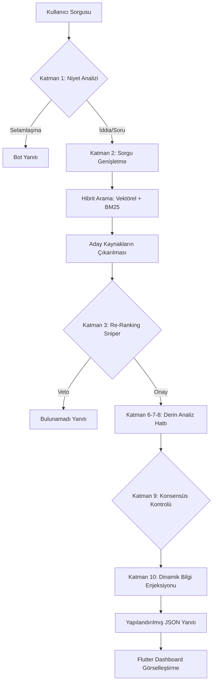

<p align="center">
  
</p>

# 🛡️ KızılelmAI: Yerel Analiz ve Doğrulama Motoru (v3.0 Elite)

<p align="center">
  
  
  
  <br>
  
</p>

> "Bilgi kirliliğine karşı yerli ve milli bir kalkan."

KızılelmAI, modern Doğal Dil İşleme (NLP) tekniklerini kullanarak haberlerin ve iddiaların doğruluğunu çok katmanlı bir süzgeçten geçiren, yüksek performanslı bir analitik motor ve görselleştirme dashboard'udur.

## 🚀 Proje Vizyonu (Vision)

**KızılelmAI**, modern dezenformasyon ve makamsal manipülasyon tehditlerine karşı geliştirilmiş, tamamen yerel (offline) çalışan bir hakikat bekçisidir. Proje, sadece bir yapay zeka sohbet botu değil; her iddiayı 10 farklı analitik katmanda sorgulayan bir **doğrulama mühendisliği** ürünüdür.

---

## 🏛️ Mimari Bakış (Architecture)

KızılelmAI, "Beyin" (Python/FastAPI) ve "Yüz" (Flutter) olmak üzere iki ana bileşenden oluşur. Aşağıdaki şema, bir kullanıcının gönderdiği iddianın sistem içerisinde nasıl bir yolculuk yaptığını göstermektedir.



---

## 📂 Proje Dosya Yapısı ve Açıklamalar

Projenin tüm bileşenlerinin ne işe yaradığı aşağıda detaylandırılmıştır:

### ⚙️ Genel Dizindeki Dosyalar
*   **`.venv/`**: Projenin izole bir ortamda çalışması için gerekli kütüphaneleri barındıran sanal çalışma alanı.
*   **`assets/`**: Proje logoları ve dökümantasyon görsellerini barındıran medya klasörü.
*   **`requirements.txt`**: Sistemin çalışması için gereken Python kütüphanelerinin listesi.
*   **`ROADMAP.md`**: Projenin gelecek vizyonu ve geliştirilecek özellikler listesi.

### 🧠 `src/` (Kaynak Kodlar)
*   **`src/ai_core/engine/engine.py`**: Sistemin beynidir. Tüm NLP modellerini, vektör arama algoritmalarını ve karar mantığını (Logic) içerir.
*   **`src/ai_core/evaluate.py`**: Sistemin doğruluk performansını test etmek için kullanılan metrik dosyası.
*   **`src/backend/app.py`**: FastAPI tabanlı sunucu dosyasıdır. Yapay zeka motoru ile arayüz arasındaki asenkron köprüyü kurar.
*   **`src/shared/preprocess.py`**: Gelen ham verileri (metinleri) temizleyen, küçük harfe çeviren ve NLP işlemine uygun hale getiren yardımcı modüldür.

### 📊 `data/` (Veri Katmanı)
*   **`data/processed/egitim_verisi_final.csv`**: Sistemin temel bilgi birikimini oluşturan ana haber veri seti.
*   **`data/processed/knowledge_base.json`**: Selamlaşmalar, eşanlamlı kelimeler ve özel chatbot yanıtlarını barındıran yerel sözlük.
*   **`data/processed/knowledge_base_dynamic.csv`**: Sistem çalışırken "Dinamik Enjeksiyon" (Katman 10) ile eklenen anlık bilgilerin kaydedildiği dosya.

### 📜 `scripts/` (Yardımcı Araçlar)
*   **`doctor.ps1`**: Projenin sistem gereksinimlerini ve kütüphanelerini kontrol eden "doktor" kontrol betiği.
*   **`download_models.py`**: Gerekli NLP modellerini yerel dizine indiren kurulum yardımcısı.

### 🖥️ `frontend/` (Dashboard/Arayüz)
*   **`lib/`**: Flutter arayüzünün kaynak kodları (Main, Screens, Services, Widgets).
*   **`pubspec.yaml`**: Dashboard için gerekli Flutter paketlerinin listesi.

---

## 🚀 Kullanılım ve Teknik Komutlar

### 🛡️ Port ve Uygulama Yönetimi
Uygulamayı başlatırken veya sıfırlarken aşağıdaki komutlar hayati önem taşır:

1.  **Arka Plandaki Python Süreçlerini Kapatma:**
    Eğer sunucu hata verirse veya port (5000) meşgulse, açık kalan tüm Python servislerini kapatmak için:
    ```powershell
    # Windows (PowerShell)
    taskkill /F /IM python.exe
    ```

2.  **API Sunucusunu Başlatma:**
    ```bash
    python src/backend/app.py
    ```

3.  **Swagger UI (Dokümantasyon) Erişimi:**
    Backend ayağa kalktığında, tüm API uç noktalarını görsel olarak test etmek için Swagger arayüzüne şu port üzerinden ulaşabilirsiniz:
    `http://127.0.0.1:5000/docs`

4.  **Frontend (Dashboard) Başlatma:**
    ```bash
    cd frontend
    flutter run -d web-server --web-port 8080
    ```

---

## 🔍 Derin Analiz Hattı (10 Katmanlı Süzgeç)

KızılelmAI'yi rakiplerinden ayıran en önemli özellik, bir iddiayı doğrularken geçtiği analitik aşamalardır:

| Katman | Adı | İşlevi |
| :--- | :--- | :--- |
| **L1** | **Niyet Analizi** | Kullanıcı niyetini belirler. (Greeting vs Claim) |
| **L2** | **NLP Sorgu Genişletme** | Kelimeleri anlamsal olarak genişletir. (Maraş -> Kahramanmaraş) |
| **L3** | **Re-Ranking Sniper** | Alakasız adayları veto eden ve en mantıklı olanı seçen keskin nişancı. |
| **L4** | **Vektörel Benzerlik** | Cümleler arası anlamsal (embedding) örtüşmeyi ölçer. |
| **L5** | **Kelime Çapası** | Kritik kelimelerin varlığını manuel olarak denetler. |
| **L6** | **Akıllı Fark Analizi** | Tarih, sayı ve unvan (Vali/CEO) farklarını yakalar. |
| **L7** | **Konsept Birleştirici** | Önceki sorulardaki bağlamı hatırlar (NLP Context). |
| **L8** | **Otorite Ağırlığı** | Kaynak güvenilirliğini skora dahil eder. |
| **L9** | **Çok Kaynaklı Konsensüs** | Kaynaklar arası çelişkiyi ve fikir birliğini denetler. |
| **L10** | **Dinamik Enjeksiyon** | Çalışma anında yeni bilgiler aşılanabilir. |

---
*Hazırlayan: Sinan & Antigravity (KızılelmAI Team)*
