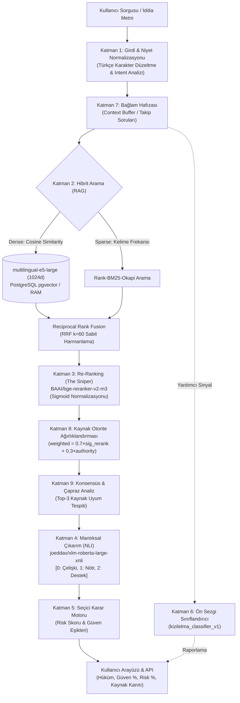

<div align="center">
  
  <h1>KızılelmAI - Gelişmiş Haber ve İddia Doğrulama Motoru</h1>
  <p><strong>Yapay Zeka Destekli, Çok Katmanlı ve Otonom Fact-Checking (Doğrulama) Sistemi</strong></p>
  <p>
    <a href="https://github.com/ETU-Digital-Design-Lab/bsc-2026-group-5-kizilelmai-news-verifier"></a>
    
    
    
    
    
  </p>
</div>

---

## 📌 Proje Hakkında ve Amaç

**KızılelmAI**, internette ve sosyal medyada yayılan haber ve iddiaların **gerçek mi, yanıltıcı mı yoksa asılsız mı** olduğunu saniyeler içinde kanıtlarıyla analiz eden yapay zeka tabanlı bir doğrulama motorudur.

Sistem, yüzeysel anahtar kelime eşleşmelerinin ötesine geçerek; **vektörel ve anlamsal hibrit arama (Dense + Sparse RAG)**, **derin yeniden sıralama (Cross-Encoder Re-Ranking)**, **kaynak otorite puanlaması** ve **doğal dil çıkarımı (NLI)** katmanlarını bir araya getiren 10 katmanlı bir akıl yürütme mimarisi kullanır.

### Temel Prensipler ve Değer Önerisi:
* **Seçici Tahmin (Selective Prediction):** Sistem her iddiaya körü körüne tahmin yürütmez. Kanıtın yetersiz veya zayıf olduğu durumlarda uydurma (halüsinasyon) üretmek yerine güvenle **çekimser kalır (Abstain)**.
* **Şeffaf Kanıt Zinciri (Provenance):** Her doğrulama kararı; kullanılan haber kaynağının adı, yayıncısı, otorite puanı ve metin içi alıntısıyla birlikte kullanıcıya sunulur.
* **Dondurulmuş Değerlendirme Güvencesi:** Akademik kıyaslamaların tutarlılığı için doğrulama korpusu 30.487 kayıt ile dondurulmuş olup, arka plan kazıyıcıları deney güvenliği için varsayılan olarak kontrol altındadır.

---

## 🏗️ 10 Katmanlı Sistem Mimarisi

KızılelmAI'nin akıl yürütme hattı (reasoning pipeline) aşağıdaki veri akış şemasına sahiptir:



### Katmanların Görev Dağılımı:

1. **Katman 1 (Girdi & Niyet Normalizasyonu):** Türkçe büyük-küçük harf dönüşümleri (`İ→i`, `I→ı`), noktalama temizliği ve sorgu niyeti ayrıştırması (selamlama, genel soru veya teyit sorgusu).
2. **Katman 7 (Bağlam Hafızası):** Önceki soruların konusunu takip eden (`MAX_CONTEXT=3`) bağlam birleştirici (`context_merger`).
3. **Katman 2 (Hibrit Arama - Dense + Sparse RAG):** `multilingual-e5-large` (1024 boyutlu) vektörleri ile anlamsal benzerlik ve `BM25Okapi` ile kelime araması. Sonuçlar **Reciprocal Rank Fusion (k=60)** ile birleştirilir.
4. **Katman 3 (Re-Ranking / Yeniden Sıralama):** `BAAI/bge-reranker-v2-m3` Cross-Encoder modeli ile aday kanıtların en alakalıları hassas olarak sıralanır; ham skor sigmoid fonksiyonundan geçirilir.
5. **Katman 8 (Kaynak Otorite Ağırlıklandırması):** Teyit.org, Malumatfuruş, resmi kurumlar ve ajansların otorite katsayıları ile rerank skoru harmanlanır (`AUTHORITY_WEIGHT = 0.30`).
6. **Katman 9 (Konsensüs Analizi):** En yüksek puanlı 3 kaynak arasında ortak görüş ya da çelişki olup olmadığı taranır.
7. **Katman 4 (Doğal Dil Çıkarımı - NLI):** `joeddav/xlm-roberta-large-xnli` modeli üzerinden iddia ve kanıt metni arasındaki mantıksal ilişki hesaplanır. (Tensör indeksleme: `0: Çelişki / Contradiction`, `1: Nötr / Neutral`, `2: Destek / Entailment`).
8. **Katman 5 (Seçici Karar & Eşik Motoru):** NLI olasılıkları, sayı/tarih farkları ve güven eşikleri değerlendirilerek **ONAY (Doğru)**, **RED (Yalan/Asılsız)** veya kanıt yetersizliğinde **ÇEKİMSER (Abstain)** kararı verilir.
9. **Katman 6 (Ön Sezgi Sınıflandırıcısı):** BERT mimarili yerel yardımcı sınıflandırıcı; karar motorunu etkilemeden ek bir sezgisel olasılık sunar.

---

## 🔬 Değerlendirme Sonuçları ve Benchmark Karşılaştırması

Sistem, bağımsız **FACTurk-500** (Altuncu, SIU 2026) benchmark veri seti üzerinde test edilmiştir. Proje boyunca uygulanan mimari düzeltmelerin ve model güncellemelerinin etkisi resmi olarak belgelenmiştir:

### FACTurk-500 Koşumları Evrim Tablosu

| Koşum | Açıklama | Embedding Modeli | NLI Yapısı | Cevap Sayısı | Kapsama (Coverage) | Seçici Doğruluk | Macro-F1 | Durum |
|:---:|---|:---:|:---:|:---:|:---:|:---:|:---:|:---:|
| **v5** | Eski Temel Sistem (Baseline) | e5-small (384d) | Eski Sıra | 266 / 500 | %53.2 | %54.14 | 0.5098 | Arşiv |
| **v6** | K-4 NLI Etiket Düzeltmesi | e5-small (384d) | **Düzeltilmiş** | 273 / 500 | %54.6 | %54.21 | 0.5275 | Doğrulandı |
| **v7** | Büyük Model Geçişi (Ara Koşum) | e5-large (1024d) | Eski Sıra (dirty) | 269 / 500 | %53.8 | %53.53 | 0.5074 | Analiz Edildi |
| **v8** | **Nihai Şampiyon Sistem** | **e5-large (1024d)** | **Düzeltilmiş** | **402 / 500** | **%80.4** | **%56.47** | **0.5647** | 🏆 **Resmi Final** |

> **Önemli Bulgular:**
> 1. **K-4 Düzeltmesi + e5-large Sinerjisi:** Düzeltilmiş NLI motoru ile `e5-large` modelinin birlikte kullanıldığı **v8 koşumunda sistem kapsaması %54'ten %80.4'e sıçramıştır.**
> 2. **Seçici Tahmin Güvenirliği:** Sistem, kanıtı net olan 402 iddiaya kesin yanıt vermiş; kanıt temeli yetersiz olan 98 iddiada (%19.6) halüsinasyon görmemek adına güvenli şekilde çekimser kalmıştır.
> 3. **Tam Tekrarlanabilirlik:** Tüm bu metrikler `results/facturk_full_v8/` altında `metrics.json`, `predictions.csv` ve `run_manifest.json` dosyaları ile sabitlenmiştir.

---

## 📁 Dizin ve Dosya Haritası

Projeye dahil olan araştırmacı ve geliştiricilerin aradıkları dosyalara kolayca ulaşabilmesi için yapı aşağıdaki şekilde organize edilmiştir:

```text
├── README.md                 # Ana tanıtım, mimari ve kılavuz (Bu dosya)
├── requirements.txt          # Python bağımlılıkları
├── docker-compose.yml        # PostgreSQL (pgvector), Redis, API ve Web servisleri
├── Dockerfile                # Backend konteynır tanımı
│
├── docs/                     # 📚 Dokümantasyon ve Akademik Raporlar
│   ├── README.md             # Dokümantasyon indeksi ve rapor listesi
│   ├── AUTHORITY_POLICY.md   # Kaynak güvenilirlik ve otorite politikası
│   ├── reports/              # Tarihli resmi teknik raporlar ve analizler
│   └── reproducibility/      # Checkpoint hash'leri ve model manifestoları
│
├── results/                  # 📊 Deney ve Değerlendirme Artefaktları
│   ├── README.md             # Tüm benchmark koşumlarının özet haritası
│   ├── facturk_full_v8/      # 🏆 Resmi Nihai Sistem Benchmark Çıktıları
│   ├── facturk_full_v6/      # K-4 Düzeltme Doğrulama Koşumu
│   ├── facturk_full_v5/      # Eski Temel (Baseline) Koşumu
│   ├── facturk_ablation_v1/  # İzolasyon ve Ablasyon Deneyleri
│   ├── k4_fix_v1/            # K-4 NLI Matematiksel Doğrulama Raporu (Gate 1 & 2)
│   ├── selective_v1/         # Hata Taksonomisi ve Seçici Tahmin Analizi
│   └── latency_v1/           # GPU/CPU Donanım Seviyesi Gecikme Ölçümleri
│
├── data/                     # 💾 Veri Setleri ve Korpus
│   ├── corpus_snapshots/     # Dondurulmuş haber korpusu (30.487 kayıt)
│   ├── external_benchmark/   # Bağımsız FACTurk-500 test seti
│   └── deprecated/           # Geri çekilen eski sentetik test setleri
│
├── src/                      # 💻 Kaynak Kodlar
│   ├── ai_core/              # Yapay Zeka Çekirdeği
│   │   ├── engine/           # 10 Katmanlı Akıl Yürütme Motoru (engine.py)
│   │   ├── models/           # Yerel yardımcı modeller (kizilelma_classifier_v1)
│   │   └── ingest/           # Veri hazırlama ve kazıyıcı modülleri
│   ├── backend/              # FastAPI Servisi, Router'lar ve Middleware
│   └── shared/               # Ortak veritabanı ve yardımcı fonksiyonlar
│
├── scripts/                  # 🛠️ Değerlendirme ve Denetim Betikleri
│   ├── audit/                # Veri seti ve etiketçi denetim araçları
│   ├── evaluation/           # Benchmark, ablasyon ve gecikme ölçüm betikleri
│   └── data/                 # Model ve korpus indirme araçları
│
└── tests/                    # 🧪 Birim ve Entegrasyon Testleri
```

---

## 🚀 Kurulum ve Çalıştırma

### Yöntem A: Doğrudan Python ile Çalıştırma (Geliştirici Modu)

1. **Gereksinimler:** Python 3.10+, CUDA destekli GPU (tercihen) veya modern çok çekirdekli CPU.
2. **Bağımlılıkları Yükleyin:**
   ```bash
   pip install -r requirements.txt
   ```
3. **Motor Canlılık / Doğrulama Testi (Smoke Test):**
   ```bash
   python -c "from src.ai_core.engine.engine import KizilelmaEngine; e = KizilelmaEngine(); print(e.ask('Türkiye uzaya ilk astronotunu gönderdi.'))"
   ```
4. **FastAPI Backend Sunucusunu Başlatın:**
   ```bash
   python src/backend/app.py
   ```
   * Swagger Arayüzü: `http://127.0.0.1:5000/docs`

### Yöntem B: Docker ile Tek Komutla Kurulum

```bash
docker compose up --build -d
```
* **Kullanıcı Arayüzü:** `http://localhost`
* **API / Backend:** `http://localhost:5000/docs`

---

## 🛠️ Kullanılan Temel Modeller ve Kütüphaneler

| Görev | Model / Kütüphane | Yapılandırma / Rol |
|---|---|---|
| **Dense Retrieval** | `intfloat/multilingual-e5-large` | 1024 boyut, FP16, `query:` / `passage:` şablonu |
| **Sparse Retrieval** | `rank_bm25 (BM25Okapi)` | Kelime frekansı ve Türkçe morfolojik normalizasyon |
| **Re-Ranking** | `BAAI/bge-reranker-v2-m3` | Cross-Encoder, Sigmoid yumuşatma (`sig_rerank`) |
| **Mantıksal Çıkarım (NLI)** | `joeddav/xlm-roberta-large-xnli` | 3 sınıflı çıkarım (Çelişki, Nötr, Destek) |
| **Yardımcı Sınıflandırıcı** | `kizilelma_classifier_v1` | 12 katman BERT mimarisi (Danışman sinyal) |
| **Backend & Veritabanı** | FastAPI, PostgreSQL 16 (pgvector), Redis | Asenkron API, vektörel dizinleme ve önbellekleme |

---

## ⚖️ Lisans ve Akademik Atıf

Bu proje Erzurum Teknik Üniversitesi bünyesinde akademik araştırma ve geliştirme amacıyla üretilmiştir. Projenin değerlendirme metrikleri ve raporları bağımsız denetime açıktır.
